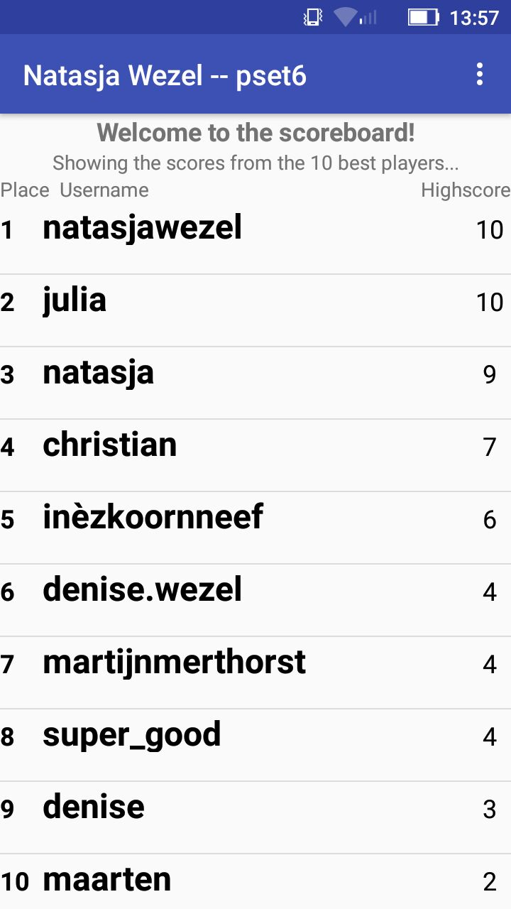

# My own App

Natasja Wezel, 11027649
Created this app as final project for Native App Studio, UvA Minor Programming - 2017

## The Trivia App
You have to make an account to be able to use this app. If you are logged in and close the app you'll be remembered as user.

You'll have to answer 10 questions to reach a highscore. Each right answer will give you 1 point. The highscores of the users of this app are displayed in a scoreboard that everyone can see.

## Screenshots of the app (on my Phone, a Lenovo C2)
First, you create an account, or log in if you already have one.

You'll be redirected to the homescreen, where you can start your quiz.

The questions you'll have to answer look like this.

And the scoreboard look like this (except if you obtain a higher score :-))

