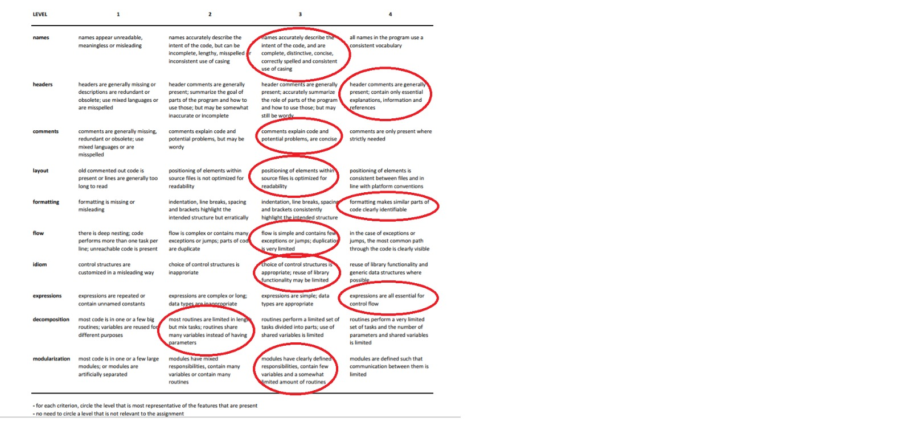

# Peer review

Although the app will be graded by the staff, we were required to perform a code review with one other student. The results of the review should are documented in this file.

The results of this review are used to improve the code before the final version was submitted.

## done by Britt van Leeuwen

*LoginActivity.java*
signIn
@param view description
Log.d is for debugging only

*MainActivity.java*
button at main to main (same for button at scoreboard to scoreboard)
After founding out it was a menu she found it less bad
We talked about it and we thought this was a point to improve, but not for today anymore.

Auto generated filename = good but give the user the opportunity to choose one themselves

íf a user is not logged in, don't go to the next activity or don't load the activity and go to the inlog activity
(check the explanation video for this) (I think she said in the video you had to control this in every activity)

45 login instead of logins

*QuestionsActivity.java*
request is really long
(Britt says "dit is echt tyfus lang)

Html.fromHtml instead of replace function (noted as @deprecated in Android??)
Make a seperate class Question()

nextQuestion
245 remove pls

*ScoreboardActivity.java*
scoreboard
log.d 152
